Random Forests in Python
========================

This module is a basic implementation of Random Forests which allows users to
define their own weak learners (the tests performed at each node). It was
written as a prototype for a C++ version with templates. It is slow, but pure
Python and easy to play with. People looking for a Python Random Forest usable in real
problems should start with [scikit-learn](http://scikit-learn.org/).

It is written for Python 3.

Classification example
----------------------

These examples train on three spiral (without noise) and predict the whole
plane. They try 4 different weak learners: axis aligned, linear, conic and parabolas.

``python example_classification.py``

Using one single tree:    

Axis aligned:    
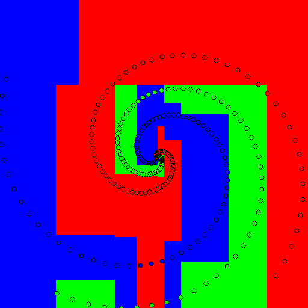

Linear:       
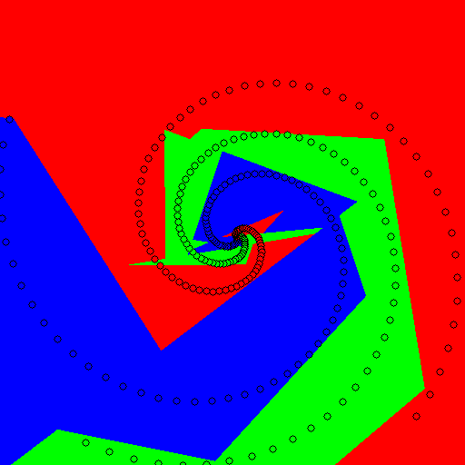

Conic:          
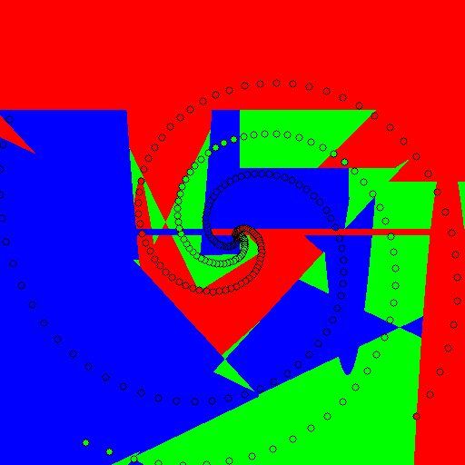

Parabola:           
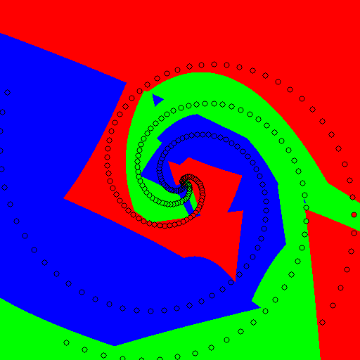

Using a forest of 10 trees, with soft or hard decision boundaries:       

Axis aligned:       
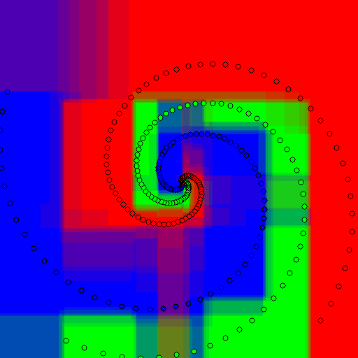 &nbsp; 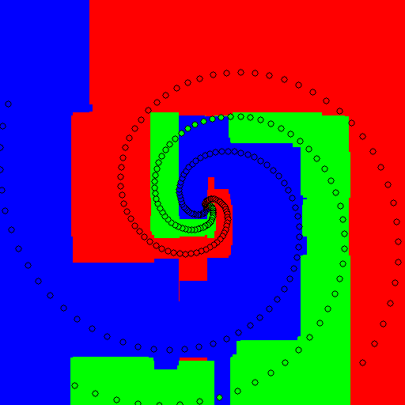

Linear:       
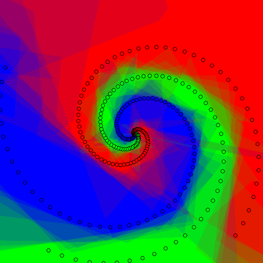 &nbsp; 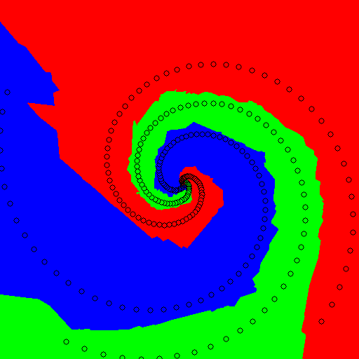

Conic:         
 &nbsp; 

Parabola:         
 &nbsp; 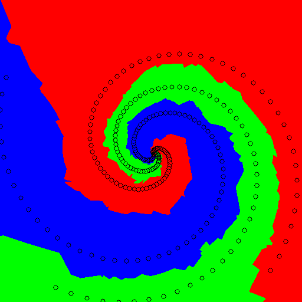

Regression example
------------------

These examples train on two circles and predict the center of the bottom right quadrant
(predicting the center of the image would be too easy!).
They try 4 different weak learners: axis aligned, linear, conic and parabolas.

``python example_regression.py``

Using one single tree:    

Axis aligned:    
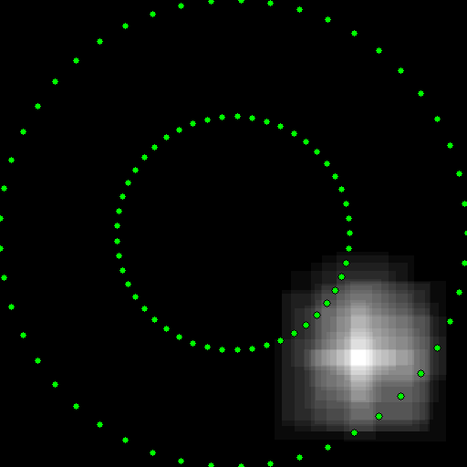

Linear:       
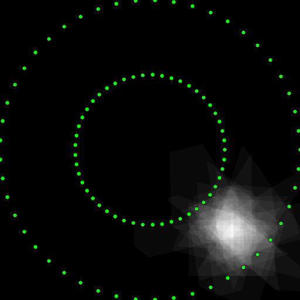

Conic:          
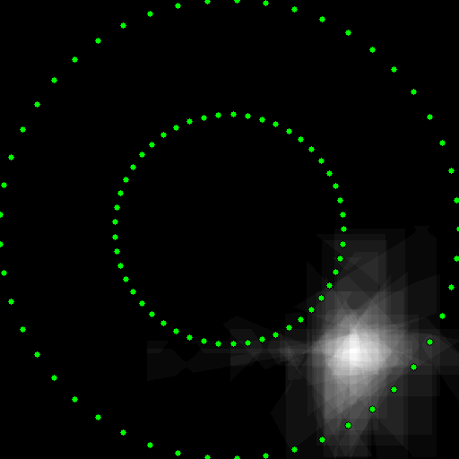

Parabola:           
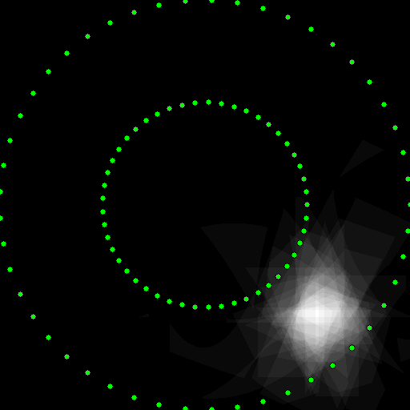

Using a forest of 10 trees       

Axis aligned:       
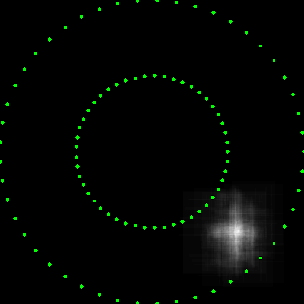

Linear:       
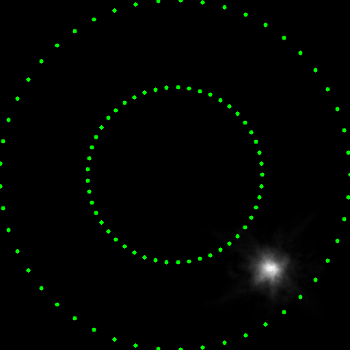

Conic:         
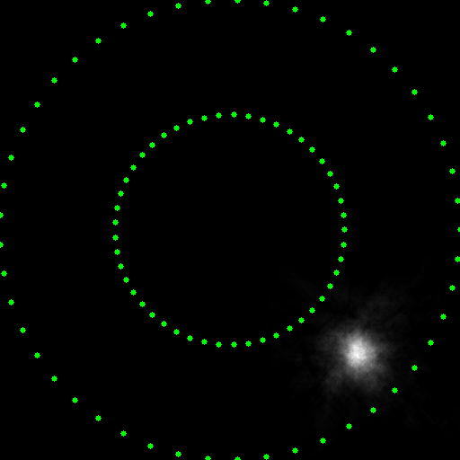

Parabola:         

Reference
---------

A. Criminisi, J. Shotton, and E. Konukoglu, "Decision Forests for Classification,
Regression, Density Estimation, Manifold Learning and Semi-Supervised Learning",
no. MSR-TR-2011-114, 28 October 2011.       
http://research.microsoft.com/en-us/projects/decisionforests/
